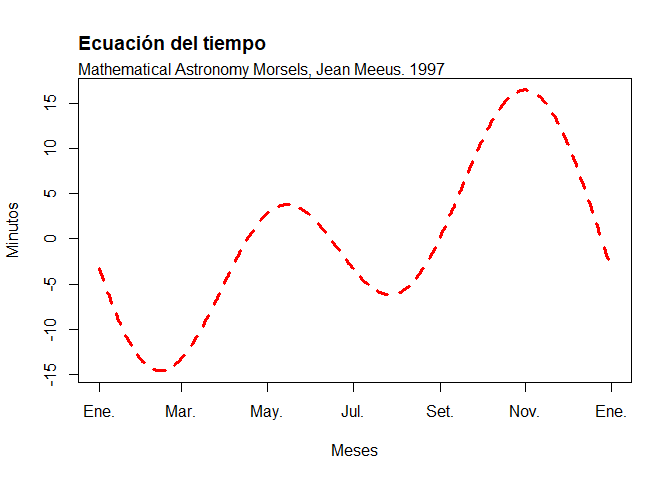

Actividad Grupal
================
Marko Rodríguez, Braulio Yucra, Emanuel Rodríguez
24/11/2021

``` r
#1 ¿Qué cantidad de dinero sobra al repartir 10000$ entre 3 
10000%%3
```

    ## [1] 1

``` r
#2 ¿Es el número 4560 divisible por 3
0 == (4560%%3)
```

    ## [1] TRUE

``` r
#3 Construya un vector con los números enteros del 2 al 87. ¿cuales de esos números son divisibles por 7?
n_enteros <- c(2:87)
divisibles_7 <- c(0 == n_enteros%%7)
which( divisibles_7 == TRUE)
```

    ##  [1]  6 13 20 27 34 41 48 55 62 69 76 83

``` r
divisibles_7[c(6, 13, 20, 27, 34, 41, 48, 55, 62, 69, 76, 83)]
```

    ##  [1] TRUE TRUE TRUE TRUE TRUE TRUE TRUE TRUE TRUE TRUE TRUE TRUE

``` r
#4 Construya dos vectores, el primero con los números enteros desde el 7 hasta 3, el segundo vector con los primeros cinco números positivos divisibles por 5.
#4.1 Sea A la condición de ser par en el primer vector
vector_1 <- c(7:3)
which( vector_1%%2 == 0 )
```

    ## [1] 2 4

``` r
A <- vector_1[c(2, 4)]
A
```

    ## [1] 6 4

``` r
#4.2 Sea B la condición de ser mayor que 10 en el segundo vector.
vector_2 <- c( seq ( 5, 25, 5 ))
which( vector_2 > 10 )
```

    ## [1] 3 4 5

``` r
B <- vector_2[c(3, 4, 5)]
B
```

    ## [1] 15 20 25

``` r
#4.3 ¿En cual de las 5 posiciones se cumple A y B simultaneamente?
for (i in 1:5) {
  for (j in 1:5){
    if(i==j){
      if(vector_1[i] == vector_2[j]){
      print(i)
    }
}
}
}
print("no hay datos")
```

    ## [1] "no hay datos"

``` r
#5
v <- c(1:100)
sum(v)
```

    ## [1] 5050

``` r
#6
v <- c(1,-4,5,9,-4)
which.min(v)
```

    ## [1] 2

``` r
#7
factorial(8)
```

    ## [1] 40320

``` r
#8
y <- c(3:7)
sum(exp(y))
```

    ## [1] 1723.159

``` r
#9
x<-c(log10(sqrt(1)),log10(sqrt(2)),log10(sqrt(3)),log10(sqrt(4)),
     log10(sqrt(5)),log10(sqrt(6)),log10(sqrt(7)),log10(sqrt(8)),
     log10(sqrt(9)),log10(sqrt(10)))
prod(x, na.rm=TRUE)
```

    ## [1] 0

``` r
#10 
Areacorona <- function(x,y){
  ((x)^2)/2*(y-sin(y))
}
Areacorona(4,pi/4)
```

    ## [1] 0.6263311

``` r
#11
Y <- c(1:30)
sort(Y)
```

    ##  [1]  1  2  3  4  5  6  7  8  9 10 11 12 13 14 15 16 17 18 19 20 21 22 23 24 25
    ## [26] 26 27 28 29 30

``` r
sort(Y, decreasing = T)
```

    ##  [1] 30 29 28 27 26 25 24 23 22 21 20 19 18 17 16 15 14 13 12 11 10  9  8  7  6
    ## [26]  5  4  3  2  1

``` r
rev(Y)
```

    ##  [1] 30 29 28 27 26 25 24 23 22 21 20 19 18 17 16 15 14 13 12 11 10  9  8  7  6
    ## [26]  5  4  3  2  1

``` r
#12
m <- c(10:100)
m^3+(4*m^2)
```

    ##  [1]    1400    1815    2304    2873    3528    4275    5120    6069    7128
    ## [10]    8303    9600   11025   12584   14283   16128   18125   20280   22599
    ## [19]   25088   27753   30600   33635   36864   40293   43928   47775   51840
    ## [28]   56129   60648   65403   70400   75645   81144   86903   92928   99225
    ## [37]  105800  112659  119808  127253  135000  143055  151424  160113  169128
    ## [46]  178475  188160  198189  208568  219303  230400  241865  253704  265923
    ## [55]  278528  291525  304920  318719  332928  347553  362600  378075  393984
    ## [64]  410333  427128  444375  462080  480249  498888  518003  537600  557685
    ## [73]  578264  599343  620928  643025  665640  688779  712448  736653  761400
    ## [82]  786695  812544  838953  865928  893475  921600  950309  979608 1009503
    ## [91] 1040000

``` r
sum(m^3+(4*m^2))
```

    ## [1] 26852735

``` r
#13
n <- c(1:25)
((2^n)/n)+((3^n)/n^2)
```

    ##  [1] 5.000000e+00 4.250000e+00 5.666667e+00 9.062500e+00 1.612000e+01
    ##  [6] 3.091667e+01 6.291837e+01 1.345156e+02 2.998889e+02 6.928900e+02
    ## [11] 1.650207e+03 4.031896e+03 1.006402e+04 2.557319e+04 6.595745e+04
    ## [16] 1.722473e+05 4.545619e+05 1.210306e+06 3.247155e+06 8.769390e+06
    ## [21] 2.381949e+07 6.502755e+07 1.783291e+08 4.910281e+08 1.357004e+09

``` r
sum(((2^n)/n)+((3^n)/n^2))
```

    ## [1] 2129170437

``` r
#14
dataset <- read.delim("https://raw.githubusercontent.com/fhernanb/datos/master/Paises.txt")
length(dataset)
```

    ## [1] 5

``` r
dataset$Pais[which.max(dataset$poblacion)]
```

    ## [1] "China_"

``` r
#15
C <- mtcars
row.names(mtcars)
```

    ##  [1] "Mazda RX4"           "Mazda RX4 Wag"       "Datsun 710"         
    ##  [4] "Hornet 4 Drive"      "Hornet Sportabout"   "Valiant"            
    ##  [7] "Duster 360"          "Merc 240D"           "Merc 230"           
    ## [10] "Merc 280"            "Merc 280C"           "Merc 450SE"         
    ## [13] "Merc 450SL"          "Merc 450SLC"         "Cadillac Fleetwood" 
    ## [16] "Lincoln Continental" "Chrysler Imperial"   "Fiat 128"           
    ## [19] "Honda Civic"         "Toyota Corolla"      "Toyota Corona"      
    ## [22] "Dodge Challenger"    "AMC Javelin"         "Camaro Z28"         
    ## [25] "Pontiac Firebird"    "Fiat X1-9"           "Porsche 914-2"      
    ## [28] "Lotus Europa"        "Ford Pantera L"      "Ferrari Dino"       
    ## [31] "Maserati Bora"       "Volvo 142E"

``` r
row.names(mtcars)[which(mtcars$mpg <18)]
```

    ##  [1] "Duster 360"          "Merc 280C"           "Merc 450SE"         
    ##  [4] "Merc 450SL"          "Merc 450SLC"         "Cadillac Fleetwood" 
    ##  [7] "Lincoln Continental" "Chrysler Imperial"   "Dodge Challenger"   
    ## [10] "AMC Javelin"         "Camaro Z28"          "Ford Pantera L"     
    ## [13] "Maserati Bora"

``` r
row.names(mtcars)[which(mtcars$cyl==4)]
```

    ##  [1] "Datsun 710"     "Merc 240D"      "Merc 230"       "Fiat 128"      
    ##  [5] "Honda Civic"    "Toyota Corolla" "Toyota Corona"  "Fiat X1-9"     
    ##  [9] "Porsche 914-2"  "Lotus Europa"   "Volvo 142E"

``` r
row.names(mtcars)[which(mtcars$wt > 2.5 & mtcars$am == 1)]
```

    ## [1] "Mazda RX4"      "Mazda RX4 Wag"  "Ford Pantera L" "Ferrari Dino"  
    ## [5] "Maserati Bora"  "Volvo 142E"

``` r
#16
x <- 0:365
y <- 2*3.14*(x-81)/365

Funcion01 <- function(y) {
  x <- 9.87 * 2 * sin(y)*cos(y)-7.53 * cos(y) -1.5 * sin(y)
  return(x)
}
Funcion01(y)
```

    ##   [1]  -3.27475168  -3.72329563  -4.16741572  -4.60670342  -5.04075588
    ##   [6]  -5.46917639  -5.89157481  -6.30756799  -6.71678019  -7.11884351
    ##  [11]  -7.51339828  -7.90009342  -8.27858687  -8.64854594  -9.00964767
    ##  [16]  -9.36157917  -9.70403796 -10.03673232 -10.35938155 -10.67171633
    ##  [21] -10.97347896 -11.26442364 -11.54431674 -11.81293705 -12.07007598
    ##  [26] -12.31553781 -12.54913985 -12.77071267 -12.98010023 -13.17716005
    ##  [31] -13.36176336 -13.53379517 -13.69315447 -13.83975421 -13.97352145
    ##  [36] -14.09439739 -14.20233740 -14.29731109 -14.37930223 -14.44830883
    ##  [41] -14.50434307 -14.54743127 -14.57761381 -14.59494508 -14.59949340
    ##  [46] -14.59134086 -14.57058326 -14.53732992 -14.49170356 -14.43384011
    ##  [51] -14.36388854 -14.28201065 -14.18838084 -14.08318593 -13.96662485
    ##  [56] -13.83890843 -13.70025913 -13.55091072 -13.39110801 -13.22110652
    ##  [61] -13.04117221 -12.85158105 -12.65261879 -12.44458050 -12.22777027
    ##  [66] -12.00250081 -11.76909305 -11.52787578 -11.27918521 -11.02336457
    ##  [71] -10.76076369 -10.49173857 -10.21665095  -9.93586787  -9.64976122
    ##  [76]  -9.35870726  -9.06308622  -8.76328180  -8.45968072  -8.15267223
    ##  [81]  -7.84264767  -7.53000000  -7.21512329  -6.89841227  -6.58026188
    ##  [86]  -6.26106675  -5.94122077  -5.62111657  -5.30114511  -4.98169516
    ##  [91]  -4.66315287  -4.34590131  -4.03031999  -3.71678443  -3.40566571
    ##  [96]  -3.09733004  -2.79213830  -2.49044564  -2.19260105  -1.89894696
    ## [101]  -1.60981882  -1.32554472  -1.04644501  -0.77283189  -0.50500911
    ## [106]  -0.24327155   0.01209508   0.26081458   0.50262061   0.73725692
    ## [111]   0.96447776   1.18404803   1.39574368   1.59935184   1.79467116
    ## [116]   1.98151199   2.15969658   2.32905932   2.48944690   2.64071845
    ## [121]   2.78274574   2.91541330   3.03861853   3.15227182   3.25629660
    ## [126]   3.35062950   3.43522031   3.51003207   3.57504111   3.63023702
    ## [131]   3.67562266   3.71121415   3.73704081   3.75314511   3.75958259
    ## [136]   3.75642181   3.74374419   3.72164393   3.69022786   3.64961529
    ## [141]   3.59993787   3.54133936   3.47397547   3.39801364   3.31363284
    ## [146]   3.22102326   3.12038616   3.01193353   2.89588782   2.77248168
    ## [151]   2.64195763   2.50456777   2.36057341   2.21024477   2.05386062
    ## [156]   1.89170792   1.72408143   1.55128337   1.37362299   1.19141621
    ## [161]   1.00498519   0.81465793   0.62076782   0.42365327   0.22365723
    ## [166]   0.02112677  -0.18358738  -0.39013126  -0.59814811  -0.80727890
    ## [171]  -1.01716271  -1.22743722  -1.43773921  -1.64770495  -1.85697072
    ## [176]  -2.06517326  -2.27195023  -2.47694068  -2.67978550  -2.88012789
    ## [181]  -3.07761382  -3.27189247  -3.46261670  -3.64944347  -3.83203430
    ## [186]  -4.01005571  -4.18317962  -4.35108381  -4.51345231  -4.66997582
    ## [191]  -4.82035212  -4.96428643  -5.10149182  -5.23168960  -5.35460964
    ## [196]  -5.46999076  -5.57758105  -5.67713823  -5.76842993  -5.85123405
    ## [201]  -5.92533901  -5.99054406  -6.04665956  -6.09350719  -6.13092027
    ## [206]  -6.15874391  -6.17683528  -6.18506380  -6.18331132  -6.17147227
    ## [211]  -6.14945388  -6.11717627  -6.07457256  -6.02158905  -5.95818525
    ## [216]  -5.88433398  -5.80002145  -5.70524728  -5.60002454  -5.48437977
    ## [221]  -5.35835296  -5.22199756  -5.07538041  -4.91858173  -4.75169501
    ## [226]  -4.57482696  -4.38809738  -4.19163909  -3.98559774  -3.77013171
    ## [231]  -3.54541194  -3.31162172  -3.06895654  -2.81762386  -2.55784290
    ## [236]  -2.28984438  -2.01387030  -1.73017365  -1.43901816  -1.14067797
    ## [241]  -0.83543736  -0.52359044  -0.20544077   0.11869891   0.44850710
    ## [246]   0.78365383   1.12380111   1.46860326   1.81770730   2.17075340
    ## [251]   2.52737523   2.88720042   3.24985098   3.61494371   3.98209066
    ## [256]   4.35089960   4.72097440   5.09191556   5.46332065   5.83478474
    ## [261]   6.20590091   6.57626073   6.94545469   7.31307270   7.67870459
    ## [266]   8.04194055   8.40237162   8.75959019   9.11319044   9.46276885
    ## [271]   9.80792466  10.14826032  10.48338199  10.81290000  11.13642927
    ## [276]  11.45358983  11.76400720  12.06731289  12.36314480  12.65114765
    ## [281]  12.93097344  13.20228183  13.46474055  13.71802578  13.96182260
    ## [286]  14.19582530  14.41973776  14.63327385  14.83615772  15.02812416
    ## [291]  15.20891892  15.37829903  15.53603306  15.68190144  15.81569672
    ## [296]  15.93722381  16.04630024  16.14275639  16.22643568  16.29719479
    ## [301]  16.35490384  16.39944653  16.43072033  16.44863662  16.45312075
    ## [306]  16.44411221  16.42156470  16.38544617  16.33573892  16.27243960
    ## [311]  16.19555928  16.10512339  16.00117178  15.88375864  15.75295247
    ## [316]  15.60883604  15.45150630  15.28107426  15.09766494  14.90141719
    ## [321]  14.69248357  14.47103019  14.23723656  13.99129536  13.73341227
    ## [326]  13.46380574  13.18270675  12.89035857  12.58701651  12.27294763
    ## [331]  11.94843045  11.61375464  11.26922074  10.91513981  10.55183306
    ## [336]  10.17963156   9.79887584   9.40991550   9.01310889   8.60882263
    ## [341]   8.19743128   7.77931689   7.35486858   6.92448214   6.48855954
    ## [346]   6.04750855   5.60174221   5.15167848   4.69773966   4.24035202
    ## [351]   3.77994526   3.31695208   2.85180767   2.38494926   1.91681560
    ## [356]   1.44784650   0.97848232   0.50916352   0.04033014  -0.42757869
    ## [361]  -0.89412520  -1.35887349  -1.82139004  -2.28124410  -2.73800828
    ## [366]  -3.19125893

``` r
x <-seq(as.Date("2021-01-01"), as.Date("2022-01-01"), "day")

plot(x, Funcion01(y), ylab = "Minutos", xlab = "Meses", col="red", type = "l", lwd = 3, lty = 2)
mtext("Mathematical Astronomy Morsels, Jean Meeus. 1997", side = 3, adj = 0)
title("Ecuación del tiempo",
      adj = 0.000001,
      line = 1.5)
```

<!-- -->
